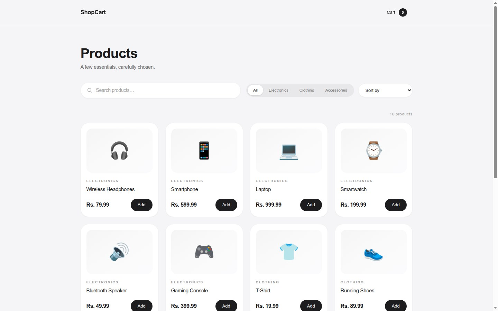
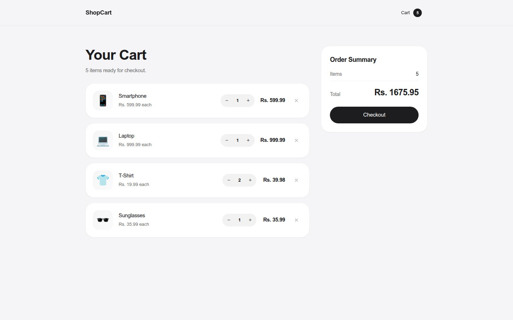
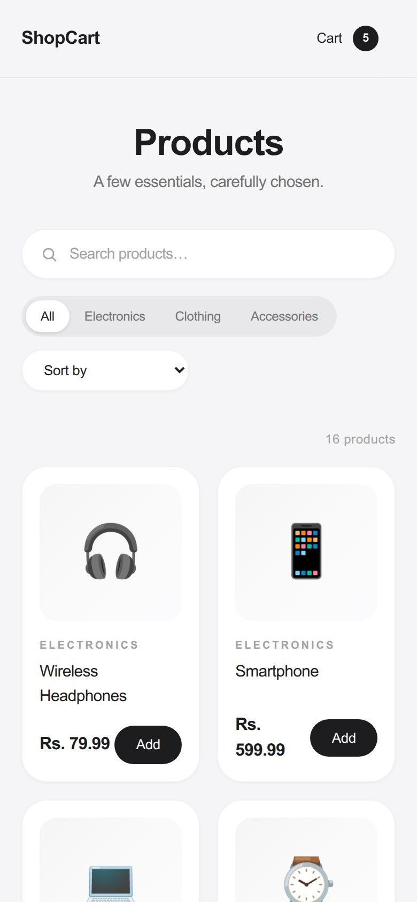

# 🛒 ShopCart — Mini E-Commerce Product Catalog & Cart

ShopCart is a lightweight single-page e-commerce store built with React. Shoppers can browse a mock
product catalog, search and filter items, sort them, and manage a shopping cart that persists between
sessions. It demonstrates core React concepts: components, props, state, hooks, routing, and
conditional/list rendering.

## Features

- Product catalog with mock data (16 products across Electronics, Clothing, and Accessories)
- Live search by product name
- Filter by category (All / Electronics / Clothing / Accessories)
- Sort by price (low↔high) or name (A–Z)
- Add items to cart with automatic quantity merging
- Update quantities (+, −) and remove items from the cart
- Running cart total and live item-count badge in the navbar
- Toast notifications for add-to-cart, remove, and order confirmation
- Checkout confirmation screen (no real payments)
- Cart persistence with `localStorage` so the cart survives page refreshes
- Responsive layout for desktop and mobile
- Empty-state and no-results messages

## Technologies / Libraries

- React 19 (functional components + hooks)
- Vite (build tool and dev server)
- React Router DOM (Catalog `/` and Cart `/cart` views)
- Tailwind CSS (utility-first styling)
- React Hot Toast (toast notifications)

## Setup Instructions

```bash
# 1. Install dependencies
npm install

# 2. Start the dev server
npm run dev

# 3. Open the printed URL (default: http://localhost:5173)
```

Other commands:

```bash
npm run build   # production build into dist/
npm run lint    # run oxlint
npm run preview # preview the production build
```

## Screenshots

> Add 2–3 screenshots of the running app below, e.g.:
>
> 1. Catalog page (desktop) with products, search bar, and category filter
> 2. Cart page with quantity controls and order summary
> 3. Catalog on a mobile/narrow viewport

**1. Catalog view**



**2. Cart view**



**3. Mobile view**



## Project Structure

```
src/
├── components/     # Reusable UI components (Navbar, ProductCard, CartItem, ...)
├── data/           # Mock catalog data
├── hooks/          # Custom hooks (useCart, useLocalStorage)
├── pages/          # Route-level views (CatalogPage, CartPage)
├── App.jsx         # Router setup and cart state wiring
└── main.jsx        # React entry point
```

## Known Limitations

- No real payments — checkout is a simulated confirmation screen
- No user accounts or order history
- Product images are emoji placeholders instead of real photos
- Cart contents have no expiry (persisted indefinitely in `localStorage`)